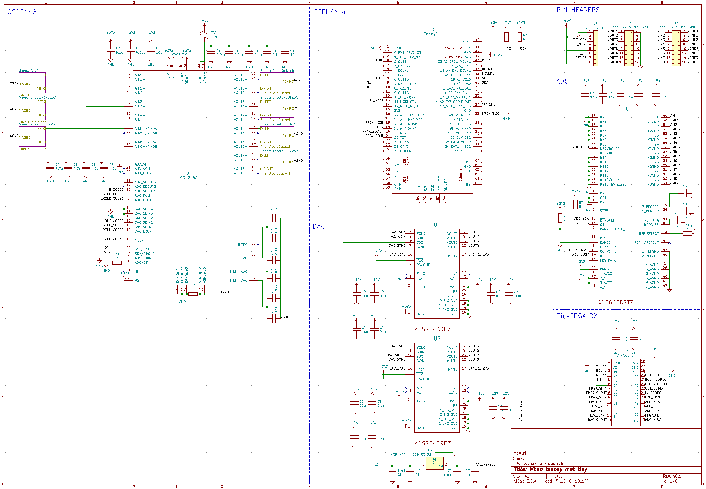

# When teensy met tiny...
* A work in progress: pairing a teensy 4.1 with a tinyfpga BX

So far, just a fairly basic schematic template with:
* cs42448 (6-in 8-out audio codec)
* AD7606 analog-to-digital (8 input channels,16 bits per sample, -10v to +10v)
* 2 x AD5754 (digital-to-analog, 4 output channels each, 16 bits per sample, -10v to +10v)

## credits
* footprints and schematics for teensy 
  * https://github.com/XenGi/teensy_library
  * https://github.com/XenGi/teensy.pretty  
* tinyfpga  
  * https://github.com/tinyfpga/TinyFPGA-BX

## Schematic

